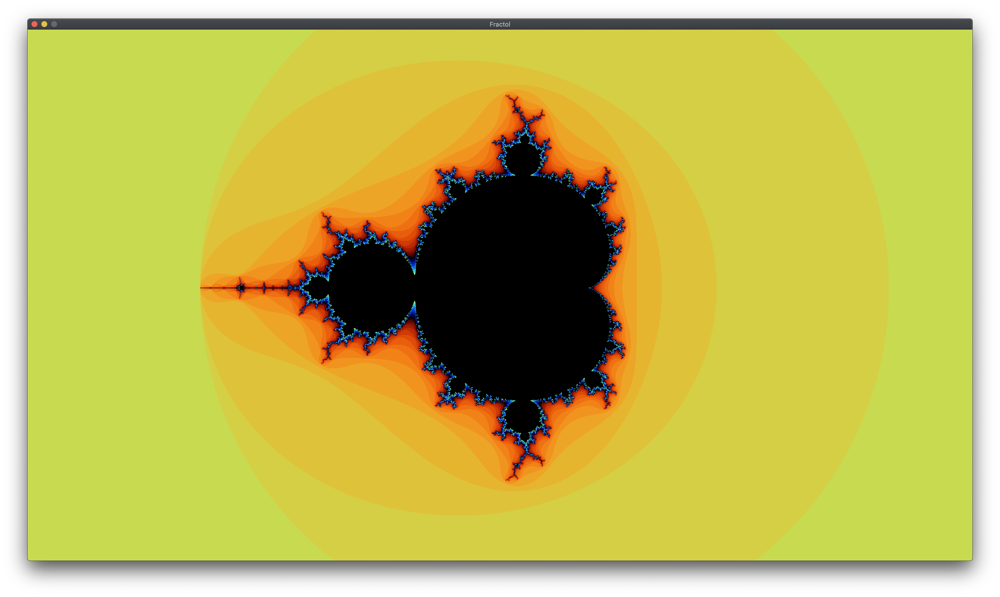
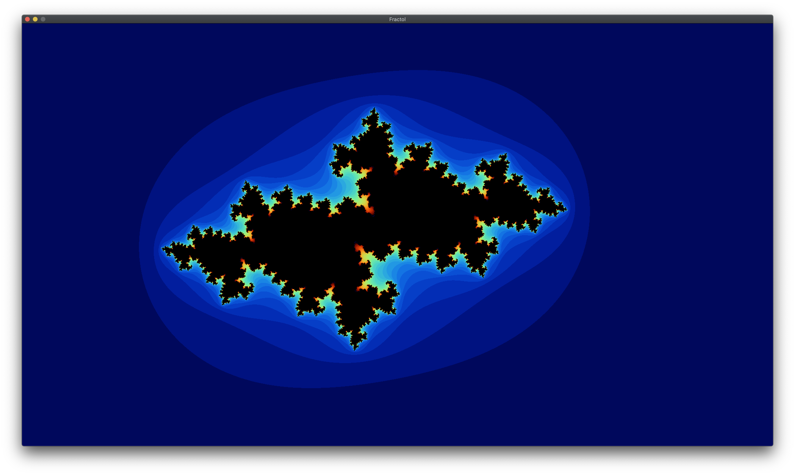
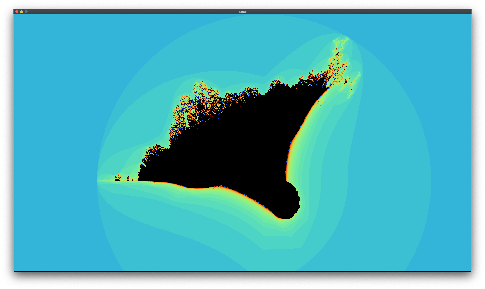
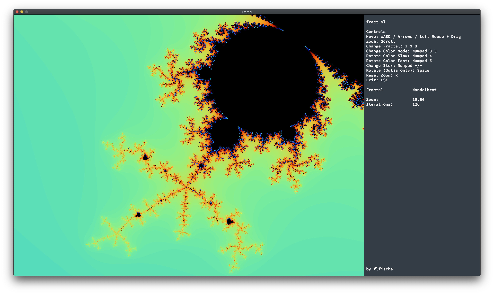

<p align="center">
  
</p>

<p align="center">
  Score: <i>125/100</i><br>
  Finished: <i>24.04.2024</i>
</p>

# fract-ol
* This project is about creating graphically beautiful fractals.*

> The term fractal was first used by mathematician Benoit Mandelbrot in 1974. He based
it on the Latin word fractus which means "broken" or "fractured".
A fractal is an abstract mathematical object, like a curve or a surface, which pattern
remains the same at every scale.
Various natural phenomena – like the romanesco cabbage – have some fractal features.

# Compiling
```bash
$ make
```

# Usage
```bash
./fractol [options] [fractal]
Options:
        -o                      Activate overlay
Available Fractals:
        mandelbrot
        julia [re] [im] (re & im between -2 and 2)
        burningship
```

# Examples



